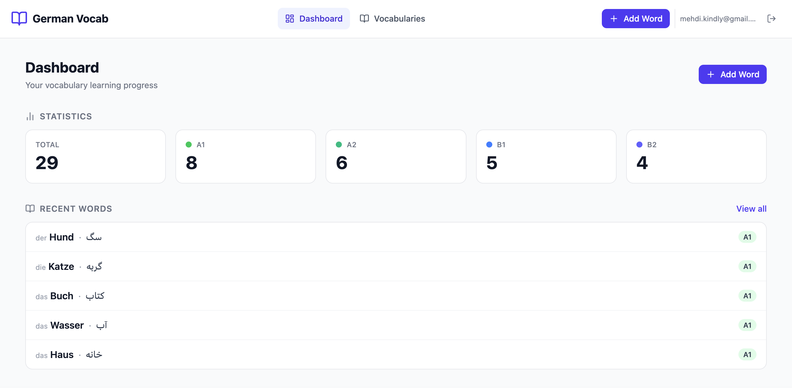

# German Vocabulary Manager

A personal vocabulary tracker built for Persian speakers learning German. You can add words with their article (der/die/das), Persian translation, an example sentence, and CEFR level — then search, filter, and review them from a clean dashboard.



## Stack

- **Frontend** — React 19 + TypeScript + Vite, TailwindCSS v4, React Query, React Hook Form + Zod
- **Backend** — Bun + Hono (runs on port 3001)
- **Database & Auth** — Supabase (PostgreSQL + JWT auth + Row Level Security)

## Prerequisites

- [Bun](https://bun.sh) ≥ 1.0
- A [Supabase project](https://app.supabase.com) (free tier is fine)

## Setup

### 1. Database

Go to your Supabase project → **SQL Editor** and run the two migration files in order:

1. `supabase/migrations/20240101000000_create_profiles.sql`
2. `supabase/migrations/20240101000001_create_vocabularies.sql`

That's it — no CLI needed.

> To seed some sample words for testing, run `supabase/migrations/seed_vocabularies.sql` after the migrations.

### 2. Frontend

```bash
cd frontend
cp .env.example .env
bun install
bun dev
```

Open `frontend/.env` and fill in:

```env
VITE_SUPABASE_URL=https://<your-project-ref>.supabase.co
VITE_SUPABASE_PUBLISHABLE_KEY=sb_publishable_...   # Settings → API → publishable key
VITE_API_URL=http://localhost:3001/api
```

### 3. Backend

```bash
cd backend
cp .env.example .env
bun dev
```

Open `backend/.env` and fill in:

```env
SUPABASE_URL=https://<your-project-ref>.supabase.co
SUPABASE_SECRET_KEY=sb_secret_...   # Settings → API → secret key — keep this private
PORT=3001
FRONTEND_URL=http://localhost:5173
```

Both are now running — frontend on [localhost:5173](http://localhost:5173), backend on [localhost:3001](http://localhost:3001).

## Seeding test data

After the migrations are applied, you can seed 30 sample words from the backend:

```bash
cd backend
bun run seed
# or target a specific account:
bun run seed --email=you@example.com
```

## API

All routes require `Authorization: Bearer <supabase_jwt>`.

| Method | Path | Description |
|--------|------|-------------|
| `GET` | `/api/vocabularies` | List with optional search, level filter, pagination |
| `POST` | `/api/vocabularies` | Add a new word |
| `PATCH` | `/api/vocabularies/:id` | Edit a word |
| `DELETE` | `/api/vocabularies/:id` | Delete a word |
| `GET` | `/api/vocabularies/stats` | Counts by level for the dashboard |

Query params for the list endpoint: `search`, `level` (A1–C2), `page`, `limit` (max 100).

## Features

- Register / login with email and password
- Add words with article, Persian translation, example sentence, and level
- Search across German and Persian text simultaneously
- Filter by CEFR level (A1 → C2)
- Paginated word list with inline edit and delete
- Dashboard with total count and a breakdown per level
- Each user only ever sees their own words (RLS enforced at the database level)
